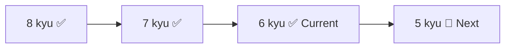

<!-- Animated Header -->

  

  

  
  
  
  

  <a href="#-about">About</a> •
  <a href="#-goals">Goals</a> •
  <a href="#-repository-structure">Structure</a> •
  <a href="#-current-progress">Progress</a> •
  <a href="#-learning-resources">Resources</a> •
  <a href="#-contributing">Contributing</a>

---

## 👋 About

Hi, I'm **Omar Rehan**, a Front-End web developer.

This repository holds my solutions to coding challenges from **Codewars**, **W3Resource**, and **LeetCode**, all written in **JavaScript**. The goal is to sharpen problem-solving, deepen my JavaScript knowledge, and build algorithmic thinking, with a focus on Front-End concepts.

I follow a YouTube channel that explains Codewars solutions, which helps me understand problems deeply and learn efficient strategies.

---

## 🎯 Goals

- [x] Reach **6 kyu** on Codewars
- [ ] Progress to **5 kyu** and beyond
- [ ] Solve daily JavaScript challenges from Codewars, W3Resource, and LeetCode
- [ ] Strengthen Front-End fundamentals (Arrays, Objects, DOM manipulation)
- [ ] Solve **50 Easy** LeetCode problems, then start **Medium**
- [ ] Build a strong foundation in algorithms and data structures for interviews
- [ ] Document solutions clearly as a reference for myself and others

---

## 📁 Repository Structure

| Folder | Content |
| --- | --- |
| 📁 **Codewars** | Katas organized by level: `8_kyu`, `7_kyu`, `6_kyu` |
| 📁 **W3Resource** | Exercises by topic: `Functions`, `Loops`, `Events`, `DOM`, `Regular Expressions`, `OOP`, and more |
| 📁 **LeetCode** | Problems organized by difficulty, e.g. `Easy` |

### 📝 Each file includes

1. 🔗 Link to the challenge
2. 📄 Problem description
3. 💻 JavaScript solution
4. 💡 Brief explanation highlighting the key JavaScript concepts used
5. 📚 *(Optional)* "Lessons Learned" section

---

## 📈 Current Progress

### ⚔️ Codewars

| | |
| --- | --- |
| **Current level** | 6 kyu |
| **Points** | 500 |
| **Progress** | Reached 6 kyu and completed several katas at this level |
| **Next goal** | Keep solving 6 kyu katas to prepare for 5 kyu. Moving up usually means tackling harder katas (5–4 kyu) and earning roughly 700–900 total points |

### 🧠 LeetCode

| | |
| --- | --- |
| **Status** | Beginner, focusing on Easy problems |
| **Next goal** | Solve at least 50 Easy problems, then start Medium |

---

## 📚 Learning Resources

| Resource | Description |
| --- | --- |
| [W3Resource](https://www.w3resource.com/javascript-exercises/) | JavaScript exercises |
| [LeetCode](https://leetcode.com/problemset/all/) | Problem set |
| [100 Challenges for JS](https://www.youtube.com/watch?v=ZJ81jSdoFKI&list=PL3iticg1TvA-jMsFwDgdb6Cy_L__qL56H) | YouTube playlist explaining solutions |

---

## 🛠️ Tools & Technologies

  

- **Language:** JavaScript (ES6+)
- **Focus areas:** Problem-solving, performance optimization, and clean code
- **Front-End concepts:** Some solutions use DOM manipulation or Web APIs where relevant
- **Testing:** Unit tests with Jest *(planned)*

---

## 🚀 How to Use

1. Open the folder for the platform you want: `Codewars`, `W3Resource`, or `LeetCode`.
2. Each file contains the problem description, the JavaScript solution, and a short explanation.
3. Use the solutions as a reference to learn JavaScript concepts.

---

## 🤝 Contributing

Suggestions for improving the code or repository organization are welcome. Submit a pull request or open an issue with your ideas.

---

## 📝 Notes

- I update the repository regularly with new solutions.
- I plan to add unit tests to verify correctness and improve code quality.
- Feedback on code optimization or repository structure is greatly appreciated.

---

## 📬 Contact

To discuss solutions, share ideas, or collaborate:

  
  
  
  

  

